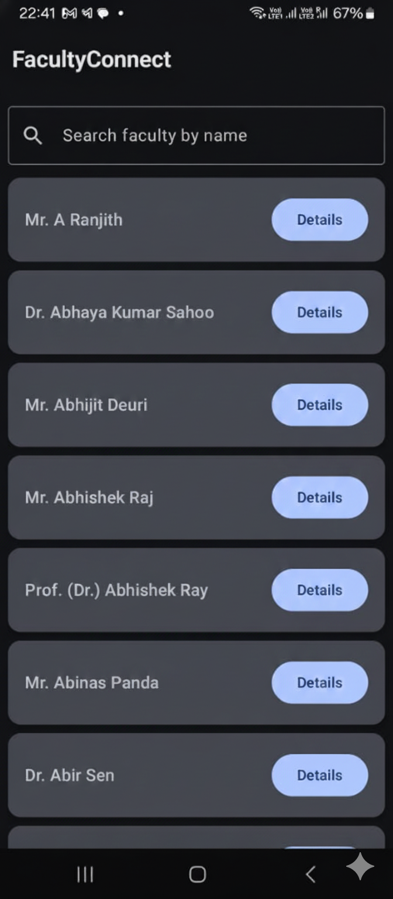

# 🎓 FacultyConnect

FacultyConnect is an Android application designed to help students quickly view faculty details from the CSE Department at KIIT University — including contact information, chambers, and direct access to their official profile page.

This project is built using **Jetpack Compose**, **Kotlin**, and **Firebase Realtime Database**.

---

## 📱 App Screenshots


| Home Screen | Details Screen | 
|------------|----------------|
|  |  |

---

## 🚀 Features

- 📡 Live faculty data fetched from Firebase Realtime Database
- 🔍 Fast search by faculty name
- 📑 Detailed profile info for each faculty
- 🔗 Redirect to official faculty page
- ⚠️ No internet detection popup (Retry & Close App options)
- 🎨 Modern UI using Jetpack Compose

---

## 🛠️ Tech Stack

| Component | Technology |
|----------|------------|
| Language | Kotlin |
| UI | Jetpack Compose |
| Architecture | MVVM |
| Networking/Data | Firebase Realtime Database |
| Dependency | Coroutines, Flow |
| Navigation | Jetpack Navigation Compose |

---

## 📥 Clone & Run the Project

```bash
# Clone the repository
git clone https://github.com/BinayakShome/FacultyConnect.git

# Open in Android Studio (Recommended: Ladybug/Bumblebee and above)
